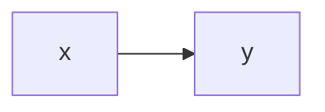

# Your index page

The landing page for your documentation.

You can go to the [API reference](api.md).

## Using math

You can use inline math like $y = x^2$. Or `$$` blocks:

$$
\lim_{x \to \infty} (1 + 1/x)^n
$$

And even ` ```math ` blocks:

```math
\lim_{x \to \infty} (1 + 1/x)^n
```

## Using mermaid diagrams

And also mermaid diagrams:


